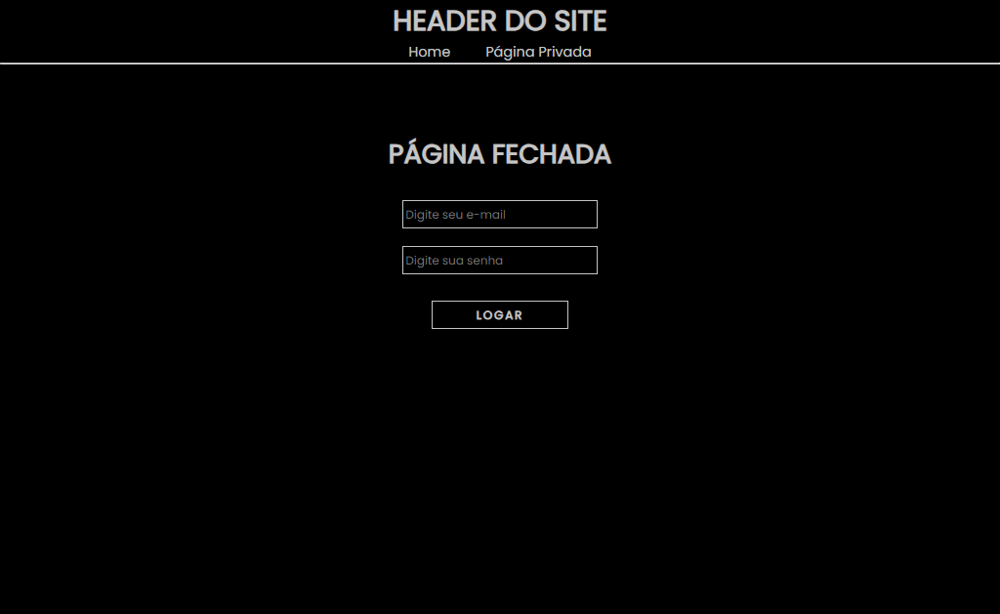

# Sistema de Login

> Login

Esse projeto é um sistema de login criado para praticar ReactJS.

[Clique para acessar](https://guimiiller.github.io/login_system/)

## 🚀 Tecnologias

- ReactJS

## 💻 O que aprendi

- Aprendi a usar o ContextAPI para compartilhar os dados
- Melhorei minhas habilidades e ganhei mais conhecimentos em TypeScript

## 📨 Contato

- guilhermemillerblack@gmail.com